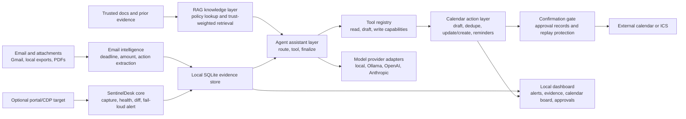

# LifeAgent / SentinelDesk Architecture

## Core Claim

LifeAgent is an email-first personal operations agent:

> The product value is turning scattered life-admin signals into verified deadlines, actions, evidence, and calendar reminders.

SentinelDesk remains the reliability core inside LifeAgent:

> A monitor must not report "no change" unless it has actually verified the high-stakes portal state.

That split keeps the assistant useful without letting an LLM or RAG path decide high-risk facts by itself.

## System Diagram

## Data Flow

1. Email sync or local JSON ingest loads messages and attachments.
2. The email layer extracts deadline, amount, and required-action facts with source IDs.
3. If the latest fact is missing, stale, or conflicting, the assistant checks stored email/calendar/portal evidence and calls a verification tool such as `capture_latest_portal`.
4. SentinelDesk captures the portal through a fixture, HTTP target, or dedicated Chrome DevTools tab, then runs health checks, fact extraction, deterministic diffing, and fail-loud classification.
5. RAG is used only for explanation over trusted docs, local evidence, and prior runs. Retrieval keeps source trust labels and ranking metadata. It does not override verified latest facts or trigger writes.
6. Verified deadlines become calendar drafts with reminder policy, source citations, and uncertainty markers.
7. Any external calendar write must pass a confirmation gate, dedupe/update before create when the remote client supports it, create a durable approval record, and reject confirmation replay.
8. The dashboard reads local state: evidence, runs, email facts, calendar drafts/events, integration checks, audit events, approvals, and retention previews.
9. Model adapters expose request shapes and structured-output validation. Cloud adapters expose only redacted env-secret status until explicit credentials and provider privacy settings are approved.

## Safety Boundaries

| Boundary | Rule |
| --- | --- |
| Latest facts | Call tools first for deadlines, balances, current status, and page changes |
| Source conflicts | Compare email facts, calendar drafts, and portal run evidence; choose the safer earlier deadline when deadlines conflict |
| RAG | Explain and retrieve context, but never replace a failed or conflicting live check and never treat retrieved content as tool-call instructions |
| Writes | Draft by default; require explicit confirmation for calendar sync, email send, deletes, uploads, or form submission |
| Retention | Preview local deletion counts by source/date first; purge only after explicit confirmation and audit the result |
| PII redaction | Redacted exports replace emails, URLs, file paths, IDs, attachment names, calendar invitees, secrets, and connector cursors/account metadata before sharing |
| Secrets | Persist only redacted environment-backed secret references and scope metadata |
| Model providers | Local by default; cloud providers must expose privacy status, redacted API-key refs, and structured `AgentAnswer` validation |
| Calendar | Dedupe before create, update by stable event ID, keep evidence links, never silently delete user-created events |
| Portal capture | Treat login expiry, captcha, maintenance, bot walls, short pages, and parser uncertainty as `uncertain` |
| High-stakes domains | Cite evidence and tell the user when an official source still needs manual verification |

## Failure Modes

| Failure mode | Behavior | Why it matters |
| --- | --- | --- |
| Email evidence conflicts | Answer `uncertain` and show the safer earlier deadline candidate when applicable | Avoids false confidence on deadlines |
| Email says "log in to view" | Call portal/CDP verification or state that current state cannot be verified | Keeps latest facts grounded |
| Session expired | `uncertain` alert | Avoids silently missing a deadline behind a login wall |
| Captcha or bot wall | `uncertain` alert | User intervention is required before the state can be trusted |
| Portal redesign | `uncertain` alert if known status markers disappear | Treats parser uncertainty as risk |
| Status or deadline changed | `critical` alert for high-stakes verticals | Surfaces action quickly |
| Footer/help text changed | `info` alert | Keeps noisy copy changes separate from deadline risk |

## Interview Talking Points

- The product is not a generic webpage watcher. The main loop is email evidence -> tool verification -> cited answer -> calendar action.
- SentinelDesk is the deterministic reliability core, so alerting still works without LangChain, RAG, or a model provider.
- LangChain/LangGraph belongs in the assistant orchestration layer because it makes model/provider and tool routing easier to swap.
- Calendar is an action and visibility layer: the user should see verified deadlines by date in month/week/day views and can sync only after confirmation.
- Safety is part of the architecture: tool capability metadata, explicit confirmations, durable approvals, replay protection, redacted reports, and retention controls.
